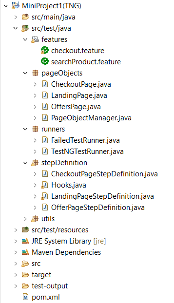

# Selenium_BDD_Framework
A robust and easy-to-use framework integrating Selenium WebDriver with Cucumber for Behavior-Driven Development (BDD). This framework enables writing human-readable test scenarios in Gherkin syntax, automating web browser interactions, and generating detailed test reports.

## Table of Contents
- [Introduction](#introduction)
- [Features](#features)
- [Prerequisites](#prerequisites)
- [Installation](#installation)
- [Configuration](#configuration)
- [Running Tests](#running-tests)
- [Project Structure](#project-structure)
- [Writing Tests](#writing-tests)
- [Reporting](#reporting)

## Introduction
This repository contains a BDD framework built using [Cucumber](https://cucumber.io/) and [Selenium](https://www.selenium.dev/). It is designed to facilitate the creation and execution of behavior-driven development tests for web applications.

[Back to top](#table-of-contents)

## Features
- **BDD Integration:** Uses Cucumber or Gherkin syntax for defining test scenarios.
- **TestNG Execution:** Harnesses the power of TestNG for test execution and reporting.
- **Modular Structure:** Organizes tests into reusable modules for scalability.
- **Reporting:** Generates comprehensive reports for test results.

### Key Points on Gherkin Language

- **Human-Readable**: Uses plain language with keywords (`Feature`, `Scenario`, `Given`, `When`, `Then`) to describe software behaviors.
- **Business-Driven**: Facilitates collaboration between technical and non-technical stakeholders.
- **Structured**: Defines scenarios in a structured format, supports parameterization with `Scenario Outline` and `Examples`.
- **Tags**: Allows tagging of scenarios and features for categorization and selective execution.
- **Integration**: Widely supported by BDD tools like Cucumber for automated testing.
- **Documentation**: Acts as executable documentation, reflecting current software behavior.
- **Concise**: Promotes writing clear, focused scenarios for clarity and maintainability.
  
[Back to top](#table-of-contents)

## Prerequisites
- [Java JDK](https://www.oracle.com/java/technologies/javase-downloads.html) (version 8 or above)
- [Maven](https://maven.apache.org/)
- [Eclipse](https://www.eclipse.org/ide/)

[Back to top](#table-of-contents)

## Installation
1. Clone the repository:
   
 **git clone https://github.com/yourusername/your-bdd-framework.git**
 
 **cd your-bdd-framework**

## Install dependencies:

 **$ mvn clean install**
  
[Back to top](#table-of-contents)

## Configuration
1. Configure the config.properties file located in the src/test/resources directory:

  **browser=chrome**
  
  **baseURL=https://rahulshettyacademy.com/seleniumPractise/#/**

2. Update the pom.xml file to include any additional dependencies required for your project.

[Back to top](#table-of-contents)

## Running Tests
1. To run the tests, use the following command:
   
 **$ mvn test**
   
3. To run specific tags:
 
 **$ mvn test -Dcucumber.options="--tags @PlaceOrder"**
   
[Back to top](#table-of-contents)

## Project Structure

[Back to top](#table-of-contents)

## Writing Tests
Create feature files in the src/test/java/features directory.
Define your steps in the src/test/java/stepDefinitions directory.
Create runner classes in the src/test/java/runners directory to execute your tests.

[Back to top](#table-of-contents)

## Reporting
After executing the tests, reports can be found in the target/cucumber-reports directory.

[Back to top](#table-of-contents)
